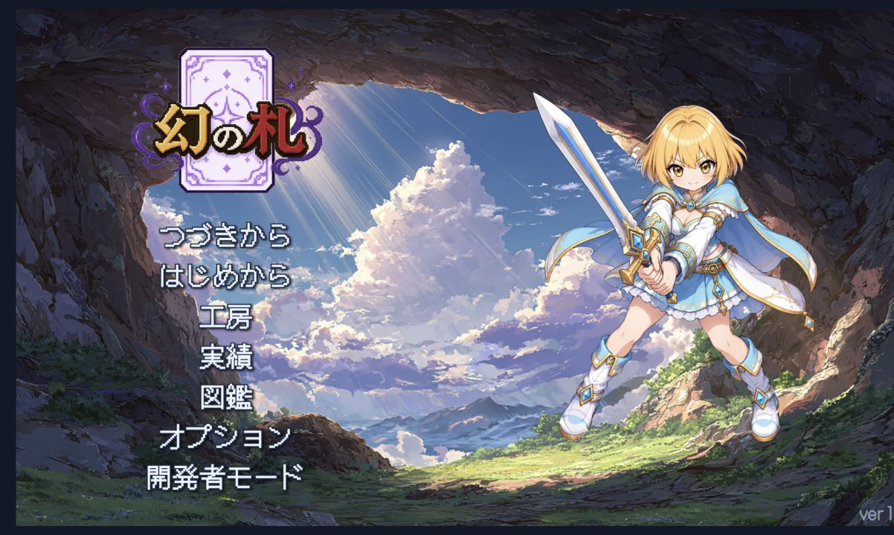

# カード式ローグライト — 技術ポートフォリオ

  

カードを集め、組み合わせ、強化しながら、ランダムに変化するマップを攻略するデッキ構築型ローグライトです。

このリポジトリは、Steam向けに開発中のゲーム本体をそのまま公開するものではなく、就職活動向けに技術面と開発プロセスを紹介するポートフォリオです。掲載コードと資料は、担当した実装やチーム開発で得た知見の一部に絞っています。

| 項目 | 内容 |
| --- | --- |
| 開発開始 | 2026年6月 |
| 開発状況 | 現在も継続して制作中 |
| 目標 | Steamでの販売 |
| 開発人数 | 5人 |
| 開発方式 | OpenAI Codexを中心としたAI駆動開発 |

2026年6月から開発を進めており、現在もSteamでの販売を目指して制作を続けています。販売前のゲーム本体には未公開の仕様やデータが含まれるため、このポートフォリオでは公開可能な技術資料、代表的なコード、スクリーンショットに絞って紹介しています。

## 開発体制

5人で役割を分担して開発しています。

| 役割 | 担当 |
| --- | --- |
| 実装担当（自分） | Unity / C#によるゲーム機能の実装、テスト、プルリクエスト作成 |
| レビュー担当 | 実装内容のコードレビュー、フィードバック、マージ |
| プロジェクト管理 | タスク整理、進行管理、チーム間の調整 |
| ドット絵担当 | ゲーム内のドット絵制作 |
| キャラクターイラスト担当 | キャラクターイラスト制作 |

レビュー担当とプロジェクト管理担当は、ゲーム開発のエンジニアではないものの、開発時点で業務としてソフトウェア開発に携わる現役エンジニアです。キャラクターイラスト担当はゲーム開発の経験があり、ゲーム制作の流れを理解したうえでアセット制作を担当しています。

実装はプルリクエスト単位で提出し、別のメンバーによるコードレビューを受けてからマージする流れで進めています。レビューで指摘された内容を修正し、実装の意図や変更範囲を説明したうえで取り込むことで、個人制作ではなくチーム開発の手順を経験しています。

詳しい役割分担と開発フローは [`docs/team-development.md`](docs/team-development.md) にまとめています。

## 自分の担当とアピールポイント

- ゲームルールや戦闘処理をUnity / C#で実装
- 実装した変更をプルリクエストとして提出し、レビューを受けて改善
- ドメインロジックを画面から分離し、Unity画面なしでもテストできる構成を検討
- UIの構造テストやスクリーンショットによる画面確認を実施
- 他メンバーのアートや進行管理と並行して、実装を統合

掲載している [`samples/`](samples/) は、担当した実装の中から設計意図とテスト方法を説明しやすいものを選んだサンプルです。ゲーム本体の全ソースや未公開データは含めていません。

## AI駆動開発

このプロジェクトでは、OpenAI Codexを開発の実装主体として使用しています。設計、実装、テスト、UI QA、ドキュメント更新までをCodexとの対話で進め、人間がコードを一行ずつ手作業で書き進める従来型ではなく、AIが開発ループを回す方式を採用しました。

人間は、ゲームの目的や制約、優先順位、受け入れ条件を決め、生成された設計・コード・テスト結果をレビューして採否を判断します。AIに作業を任せるだけではなく、チームで決めた仕様をAIに正確に伝え、検証結果をもとに次の指示を組み立てることを重視しました。

Codexが生成・修正した設計やコードは、レビュー担当の現役エンジニアが、ゲーム開発に限らないソフトウェア開発の観点からコードレビューしました。指摘内容を修正し、確認を受けた変更だけをマージすることで、AIによる実装を人間のレビューで品質確認する流れを作っています。

開発の起点となるインセプションはプロジェクト管理担当を中心に5人全員で行い、ゲームの方向性、主要なプレイ体験、役割分担、優先順位を合意しました。その後の設計から実装・テストまでをCodex中心の開発フローに接続しています。詳しい流れは [`docs/ai-driven-development.md`](docs/ai-driven-development.md) にまとめています。

ランの開始前に2枚のカードを合成して、自分だけの「オリジナルカード」を作成できます。作った切り札をデッキに組み込み、敵との戦い方や進むルートを選びながら、3層のマップの最深部を目指します。

## ゲームの流れ

1. **工房で準備する**
   2枚のカードを合成してオリジナルカードを作り、名前を付けて保存します。保存したカードには敵図鑑の報酬「エネミーオーブ」を装着できます。
2. **ランを始める**
   4種類の開始デッキから1つを選び、持ち込むオリジナルカードを決めます。
3. **マップを進む**
   戦闘、エリート戦、イベント、休憩所、鍛冶、ショップ、宝箱などから次のノードを選びます。
4. **デッキを育てる**
   戦闘報酬やショップでカード・遺物・ポーションを集め、カードを強化しながらデッキを整えます。
5. **ボスを倒す**
   各層のボスを撃破すると次の層へ進みます。第3層のボスを倒せばランクリアです。

敗北するとそのランは終了しますが、敵図鑑の進行、実績、保存したオリジナルカードなどの恒久的な要素は次のランへ引き継がれます。

## このゲームの特徴

### オリジナルカード

工房で素材カードを2枚選ぶと、2枚の効果を組み合わせたカードが完成します。カード名は自由に変更でき、最大5枚まで保存できます。

オリジナルカードはランに1枚だけ持ち込めます。敵を倒して敵図鑑を埋めると、敵の力を宿したエネミーオーブを入手でき、オリジナルカードをさらに自分好みに仕上げられます。

### 4種類の開始デッキ

| デッキ | 得意な戦い方 | 初期遺物 |
| --- | --- | --- |
| 均衡型 | 攻撃と防御を安定させる | 古びた紋章 |
| 連撃型 | 低コストカードとドローで手数を増やす | 小さな歯車 |
| 守護型 | 防御・反撃で長期戦に持ち込む | 黒のリボン |
| 侵蝕型 | 継続ダメージと弱体で敵を削る | 白冥の魂 |

### 読み合いのあるカードバトル

毎ターン回復するエナジーを使って、攻撃・防御・スキルカードを組み合わせます。敵の次の行動を確認し、ブロック、毒・弱体・裂傷などの状態異常、遺物の効果を活用して有利なターンを作ります。

一部のカードは、ラン中に使用回数などの条件を満たすと進化します。鍛冶ではカードの強化、特殊オーブの装着、遺物の変換から1つを選べます。

### 毎回変わるラン

1層につき15フロアのマップを進みます。どのノードを選ぶかによって、手に入るカードや遺物、体力の余裕、ボスまでの戦略が変わります。

## 戦闘の基本

- 手札からカードを使い、エナジーが尽きるまで行動する
- 敵の次の行動を確認し、攻撃・防御・状態異常を使い分ける
- 行動を終えたらターン終了。敵のターンを乗り越えて次の手札へ進む
- 敵を全滅させると、カード報酬・ゴールドなどを獲得できる

カードは画面上で選択して使用できます。対象を選ぶカードは敵を指定し、全体効果や自分に使うカードは発動ラインへ操作します。

## 起動方法（Unityプロジェクト）

Unity `6000.5.6f1` で `UnityProject` フォルダを開き、`Assets/Scenes/Phase5UI.unity` を再生してください。

## セーブ

ゲームの進行は自動保存されます。タイトル画面の「つづきから」から、中断したランを再開できます。
