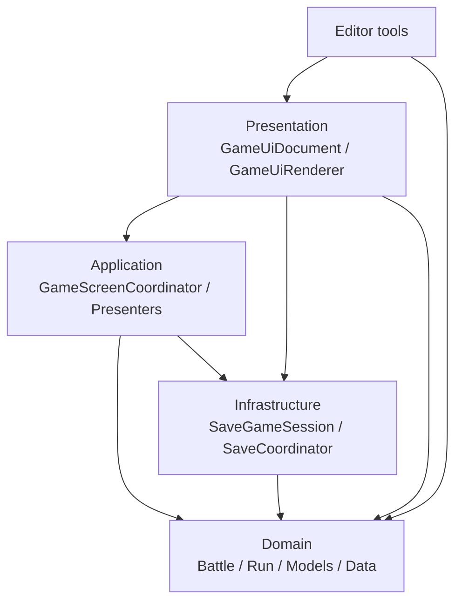
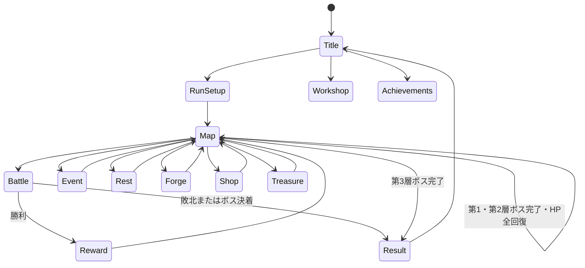
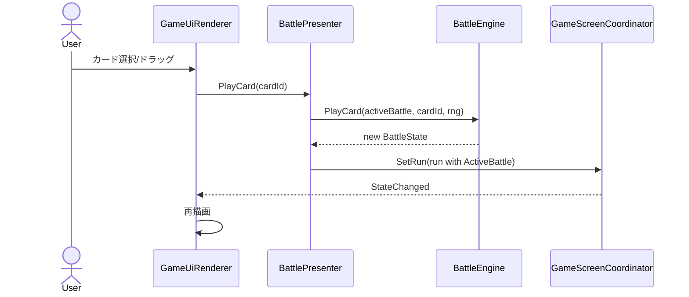

# 第1編 アーキテクチャと全体フロー

[← INDEX](./README.md)　[次: Domainモデル設計 →](./02-domain-models.md)

## 1. 設計原則

- DomainはUnity APIに依存しない純粋C#とする。
- 状態は原則immutableな`record`で表現する。
- 状態変更は現在のsnapshotを受け取り、新しいsnapshotを返す。
- ランダム性は`IRng`へ注入し、テストで決定論的に再現する。
- カード効果等の判別共用体は抽象`record`と`sealed record`の継承階層で表現する。
- Applicationは画面操作をユースケースへ変換し、Domainとセーブを調停する。
- PresentationはUI Toolkitの要素生成、描画、入力配線を担当する。
- InfrastructureはJSONシリアライズと保存媒体の差異を隠蔽する。

## 2. レイヤ構成

| Assembly | 定義 | 参照先 | Unity依存 | 主責務 |
|---|---|---|---:|---|
| Domain | [Domain.asmdef](../../UnityProject/Assets/Scripts/Domain/Domain.asmdef) | なし | なし | ルール、状態、カタログ、乱数抽象 |
| Infrastructure | [Infrastructure.asmdef](../../UnityProject/Assets/Scripts/Infrastructure/Infrastructure.asmdef) | Domain, Newtonsoft.Json | あり | セーブ/ロード、保存媒体 |
| Application | [Application.asmdef](../../UnityProject/Assets/Scripts/Application/Application.asmdef) | Domain, Infrastructure | あり | 画面遷移、Presenter、ユースケース調停 |
| Presentation | [Presentation.asmdef](../../UnityProject/Assets/Scripts/Presentation/Presentation.asmdef) | Application, Domain, Infrastructure | あり | UI Toolkit描画、画像、見た目 |

依存方向は外側から内側へ向かいます。DomainからApplication、Presentation、Infrastructureへの逆参照は禁止します。

## 3. ゲーム全体の状態遷移

画面識別と遷移の実装は[`GameScreenCoordinator.cs`](../../UnityProject/Assets/Scripts/Application/Presenters/GameScreenCoordinator.cs)、ラン内部のフェーズは[`RunModels.cs`](../../UnityProject/Assets/Scripts/Domain/Run/RunModels.cs)で定義します。

## 4. 実行時の制御フロー

1. [`GameUiDocument`](../../UnityProject/Assets/Scripts/Presentation/GameUiDocument.cs)が`SaveGameSession`と`GameScreenCoordinator`を構築する。
2. UI操作を画面別Presenterのpublicメソッドへ渡す。
3. Presenterが`BattleEngine`、`RunEngine`、各Serviceを呼び、新しい状態を得る。
4. `GameScreenCoordinator.SetRun`がラン状態を置き換え、必要に応じて中断ランを保存する。
5. 状態変更通知を受けた`GameUiRenderer`がVisualElementツリーを再構築する。
6. ラン完了時は`PersistentData.MergeRun`で恒久進捗を統合し、中断ランを削除する。

## 5. 主要シーケンス

### 5.1 カード使用

### 5.2 ノード進入

1. `MapPresenter.SelectNode`が`RunEngine.SelectNode`で経路を検証する。
2. `RunEngine.EnterNode`が`NodeKind`を判定する。
3. 戦闘なら`EnemyEncounterFactory`と`BattleEngine.StartBattle`、店なら`ShopService.Open`、イベントなら`EventService.Select`を呼ぶ。
4. `RunPhase`が更新され、Coordinatorが対応`ScreenId`へ同期する。

### 5.3 セーブ/再開

1. `SetRun`またはタイトル退避で`SaveGameSession.Suspend`を呼ぶ。
2. `SaveCoordinator`が現在モードのキーを決める。
3. `SaveJson`が派生効果型の型情報を含めて直列化する。
4. Storeが媒体へ保存する。
5. 再開時は逆順に復元し、Coordinatorが`RunPhase`から画面を決める。

## 6. 集約境界

| 集約 | ルート | 更新担当 |
|---|---|---|
| 1戦闘 | `BattleState` | `BattleEngine` |
| 1ラン | `RunState` | `RunEngine`とRun系Service |
| 恒久進捗 | `PersistentData` | `AchievementService`、`PersistentData.MergeRun` |
| 保存単位 | `SaveEnvelope` | `SaveGameSession` |

コレクションを含むrecordは参照先の深い不変性まで保証しません。更新時は新しい配列、辞書、集合を作って格納します。
